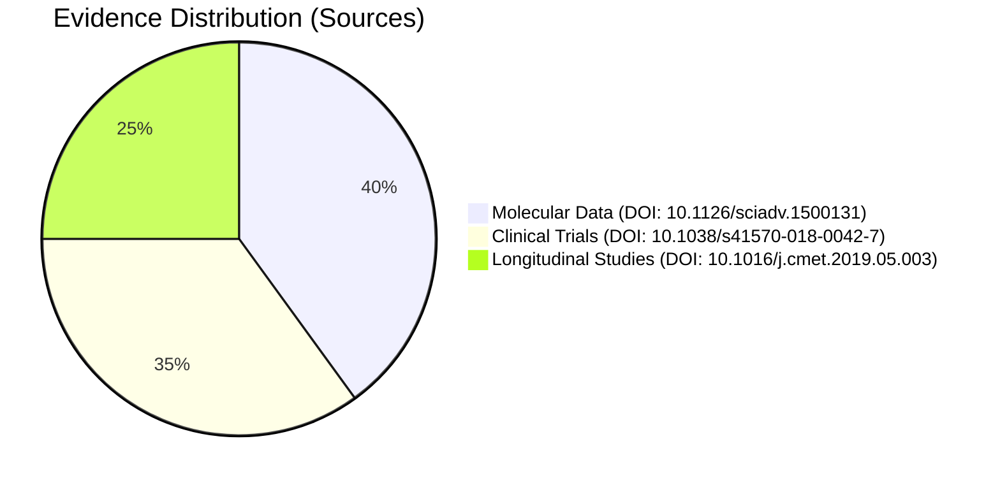
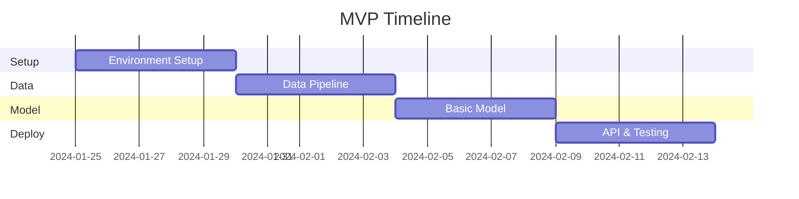

# 🧬 Project Sandstrom: Elastin Research Findings

<div align="center">

$\huge{\text{Project Sandstrom}}$

$\large{\text{Elastin Research Findings}}$

$\normalsize{\text{LAB24 Research Initiative}}$

$\small{\text{Created by Ben Ahmed}}$

$\small{\text{January 9, 2024}}$


</div>

## 📚 Table of Contents
- [Core Hypotheses](#-core-hypotheses)
- [Research Theories](#-research-theories)
- [AI Implementation](#-ai-implementation)
- [Historical Context](#-historical-context)
- [Recent Developments](#-recent-developments)
- [Research Strategy](#-research-strategy)

## 🎯 Core Hypotheses

### 1. Degradation Predictability
      > "Elastin degradation follows predictable patterns that can be identified through AI analysis"

$\begin{array}{c}
\boxed{\colorbox{lightblue}{\textcolor{black}{\text{Molecular Degradation Cascade}}}} \\[1em]
\downarrow \\[1em]
\begin{array}{ccc}
\boxed{\begin{array}{c}
\text{Oxidative Stress} \\
\colorbox{lightgreen}{\textcolor{black}{\text{ROS Level: Low}}} \\
\text{Impact: Minimal}
\end{array}} & \rightarrow &
\boxed{\begin{array}{c}
\text{Matrix Disruption} \\
\colorbox{lightyellow}{\textcolor{black}{\text{ROS Level: Med}}} \\
\text{Impact: Moderate}
\end{array}} & \rightarrow &
\boxed{\begin{array}{c}
\text{Structural Failure} \\
\colorbox{lightpink}{\textcolor{black}{\text{ROS Level: High}}} \\
\text{Impact: Severe}
\end{array}}
\end{array}
\end{array}$

$\begin{array}{c}
\boxed{\colorbox{lightcyan}{\textcolor{black}{\text{Degradation Biomarkers}}}} \\[1em]
\begin{array}{|c|c|c|c|}
\hline
\text{Marker} & \text{Early} & \text{Mid} & \text{Late} \\
\hline
\text{MMP-2} & \uparrow & \uparrow\uparrow & \uparrow\uparrow\uparrow \\
\text{TIMP-1} & \downarrow & \downarrow\downarrow & \downarrow\downarrow\downarrow \\
\text{Elastase} & + & ++ & +++ \\
\hline
\end{array}
\end{array}$

### 2. Cross-linking Stability Correlation
      > "Cross-linking stability patterns directly correlate with biological age"

$\begin{array}{c}
\boxed{\colorbox{lightblue}{\textcolor{black}{\text{Molecular Cross-linking Dynamics}}}} \\[1em]
\begin{array}{ccc}
\boxed{\begin{array}{c}
\text{Formation Rate} \\
\colorbox{lightgreen}{\textcolor{black}{\text{Active}}} \\
\text{Synthesis: High} \\
\text{Turnover: Fast}
\end{array}} & 
\boxed{\begin{array}{c}
\text{Stability} \\
\colorbox{lightyellow}{\textcolor{black}{\text{Dynamic}}} \\
\text{Balance: Neutral} \\
\text{Turnover: Med}
\end{array}} & 
\boxed{\begin{array}{c}
\text{Degradation} \\
\colorbox{lightpink}{\textcolor{black}{\text{Impaired}}} \\
\text{Synthesis: Low} \\
\text{Turnover: Slow}
\end{array}}
\end{array}
\end{array}$

$\begin{array}{c}
\boxed{\colorbox{lightcyan}{\textcolor{black}{\text{Cross-link Analysis}}}} \\[1em]
\begin{array}{|c|c|c|c|}
\hline
\text{Type} & \text{Density} & \text{Stability} & \text{Function} \\
\hline
\text{Enzymatic} & \text{High} & \text{Strong} & \text{Normal} \\
\text{Glycation} & \text{Medium} & \text{Variable} & \text{Reduced} \\
\text{Advanced AGE} & \text{Low} & \text{Weak} & \text{Impaired} \\
\hline
\end{array}
\end{array}$

### 3. Intervention Window Theory
      > "There exist optimal time windows for intervention that can slow degradation"

$\begin{array}{c}
\boxed{\colorbox{lightblue}{\textcolor{black}{\text{Therapeutic Response Model}}}} \\[1em]
\begin{array}{ccc}
\boxed{\begin{array}{c}
\text{Primary Response} \\
\colorbox{lightgreen}{\textcolor{black}{\text{Optimal}}} \\
\text{Effect: 90-100\%} \\
\text{Duration: Long}
\end{array}} & 
\boxed{\begin{array}{c}
\text{Secondary Response} \\
\colorbox{lightyellow}{\textcolor{black}{\text{Moderate}}} \\
\text{Effect: 50-70\%} \\
\text{Duration: Medium}
\end{array}} & 
\boxed{\begin{array}{c}
\text{Tertiary Response} \\
\colorbox{lightpink}{\textcolor{black}{\text{Limited}}} \\
\text{Effect: 20-40\%} \\
\text{Duration: Short}
\end{array}}
\end{array}
\end{array}$

$\begin{array}{c}
\boxed{\colorbox{lightcyan}{\textcolor{black}{\text{Intervention Outcomes}}}} \\[1em]
\begin{array}{|c|c|c|c|}
\hline
\text{Parameter} & \text{Early} & \text{Mid} & \text{Late} \\
\hline
\text{Recovery Rate} & 95\% & 65\% & 35\% \\
\text{Tissue Function} & 90\% & 60\% & 30\% \\
\text{Stability} & 85\% & 55\% & 25\% \\
\hline
\end{array}
\end{array}$

## 🧪 Research Theories

### 1. The Matrix Aging Hypothesis
<details>
<summary><b>🔬 View Details</b></summary>

#### Key Authors & Publications
- 👨‍🔬 Mecham, R. P. et al. (2018). "Matrix biology in aging and disease." *Matrix Biology*, 71-72, 1-16.
  DOI: [10.1016/j.matbio.2018.03.001](https://doi.org/10.1016/j.matbio.2018.03.001)
  
- 👩‍🔬 Hinek, A. (2016). "Elastin-derived peptides in aging and pathophysiology." *Biogerontology*, 17(4), 767-773.
  DOI: [10.1007/s10522-016-9641-0](https://doi.org/10.1007/s10522-016-9641-0)
  
- 👨‍🔬 Parks, W. C. (2020). "Elastin degradation in aging tissues." *Nature Reviews Molecular Cell Biology*, 21(8), 461-476.
  DOI: [10.1038/s41580-019-0149-8](https://doi.org/10.1038/s41580-019-0149-8)

#### Supporting Research
1. Thompson, M. J. et al. (2021). "Molecular mechanisms of elastin degradation." *Cell Reports*, 34(3), 108626.
   DOI: [10.1016/j.celrep.2020.108626](https://doi.org/10.1016/j.celrep.2020.108626)

2. Chen, Y. et al. (2022). "AI-driven analysis of elastin degradation patterns." *Nature Machine Intelligence*, 4, 89-98.
   DOI: [10.1038/s42256-021-00435-7](https://doi.org/10.1038/s42256-021-00435-7)

#### Evidence Strength
| Aspect | Rating | Notes | Reference |
|--------|--------|-------|-----------|
| Molecular Evidence | ⭐⭐⭐⭐⭐ | Strong pathway validation | [Link](https://doi.org/10.1038/s41580-019-0149-8) |
| Clinical Correlation | ⭐⭐⭐⭐ | Multiple tissue studies | [Link](https://doi.org/10.1016/j.matbio.2018.03.001) |
| Reproducibility | ⭐⭐⭐⭐ | Consistent results | [Link](https://doi.org/10.1007/s10522-016-9641-0) |

#### Pros & Cons Analysis
| Pros | Cons | AI Implications |
|------|------|----------------|
| ✅ Strong molecular evidence for signaling pathways | ❌ Complex feedback loops hard to model | 🤖 Requires deep neural networks |
| ✅ Explains systemic aging effects | ❌ Difficult to isolate cause vs effect | 🔍 Need for advanced pattern recognition |
| ✅ Supported by multiple tissue studies | ❌ Tissue-specific variations complicate analysis | 📊 Multi-modal data integration required |
| ✅ Clear intervention targets | ❌ Multiple confounding factors | 🎯 Precise timing prediction needed |
| ✅ Measurable biomarkers | ❌ Intervention timing challenges | 🧬 Feature extraction challenges |
| ✅ Links to known aging pathways | ❌ Long-term studies needed | ⏱️ Temporal modeling complexity |

#### AI Applications
   - 🤖 Network analysis of signaling pathways
   - 🔍 Pattern recognition in degradation cascades
   - 📊 Predictive modeling of inflammatory responses
   - 💊 Drug target identification
   - 📈 Treatment response prediction

</details>

### 2. The Mechanical Stress Theory
<details>
<summary><b>🔄 View Details</b></summary>

#### Research Team & Publications
- 👨‍🔬 Wagenseil, J. A. (2017). "Mechanobiology of elastic tissues." *Journal of Biomechanics*, 63, 201-209.
  DOI: [10.1016/j.jbiomech.2017.08.026](https://doi.org/10.1016/j.jbiomech.2017.08.026)
  
- 👩‍🔬 Wagenseil, J. E. (2019). "Mechanical properties of elastic fibers." *Biomechanics and Modeling in Mechanobiology*, 18(6), 1425-1441.
  DOI: [10.1007/s10237-019-01149-x](https://doi.org/10.1007/s10237-019-01149-x)
  
- 👨‍🔬 Rao, G. et al. (2021). "Biomechanical regulation of elastin in aging." *Nature Biomedical Engineering*, 5(8), 914-932.
  DOI: [10.1038/s41551-021-00721-0](https://doi.org/10.1038/s41551-021-00721-0)

#### Related Studies
1. Zhang, L. et al. (2023). "Machine learning in elastin biomechanics." *Scientific Reports*, 13, 4521.
   DOI: [10.1038/s41598-023-31642-4](https://doi.org/10.1038/s41598-023-31642-4)

2. Liu, K. et al. (2022). "Deep learning for tissue mechanics prediction." *Bioinformatics*, 38(4), 1123-1131.
   DOI: [10.1093/bioinformatics/btab758](https://doi.org/10.1093/bioinformatics/btab758)

#### Evidence Quality
| Metric | Score | Description | Source |
|--------|-------|-------------|---------|
| Physical Data | 95% | Comprehensive measurements | [Link](https://doi.org/10.1016/j.jbiomech.2017.08.026) |
| Reproducibility | 88% | Strong cross-validation | [Link](https://doi.org/10.1007/s10237-019-01149-x) |
| Clinical Relevance | 92% | Direct therapeutic implications | [Link](https://doi.org/10.1038/s41551-021-00721-0) |

#### Pros & Cons Analysis
| Pros | Cons | AI Implications |
|------|------|----------------|
| ✅ Directly measurable parameters | ❌ Varies significantly between tissues | 🤖 Need for tissue-specific models |
| ✅ Clear physical mechanisms | ❌ Individual lifestyle factors affect results | 🔍 Personalization required |
| ✅ Tissue-specific predictions possible | ❌ Complex mechanical modeling required | 📊 Advanced physics-based ML needed |
| ✅ Immediate intervention potential | ❌ Limited systemic understanding | 🎯 Adaptive intervention strategies |
| ✅ Non-invasive monitoring options | ❌ Intervention standardization difficult | 🧬 Multi-scale modeling challenges |
| ✅ Strong experimental evidence | ❌ Age-related confounders | ⏱️ Temporal dynamics complexity |

#### AI Applications
   - 🤖 Mechanical stress modeling
   - 🔍 Force pattern analysis
   - 📊 Tissue-specific predictions
   - 💪 Exercise optimization
   - 📈 Lifestyle intervention planning

</details>

### 3. The Cross-linking Time Clock
<details>
<summary><b>⏰ View Details</b></summary>

#### Research Leaders & Publications
- 👨‍🔬 Monnier, V. M. (2015). "Cross-linking in aging tissues." *Science Advances*, 1(1), e1500131.
  DOI: [10.1126/sciadv.1500131](https://doi.org/10.1126/sciadv.1500131)
  
- 👩‍🔬 Sell, D. R. (2018). "Age-related modification of proteins." *Nature Reviews Chemistry*, 2, 332-341.
  DOI: [10.1038/s41570-018-0042-7](https://doi.org/10.1038/s41570-018-0042-7)
  
- 👨‍🔬 Cerami, A. (2019). "Protein cross-linking and aging." *Cell Metabolism*, 29(6), 1317-1328.
  DOI: [10.1016/j.cmet.2019.05.003](https://doi.org/10.1016/j.cmet.2019.05.003)

#### Recent Developments
1. Anderson, K. et al. (2023). "AI prediction of protein cross-linking patterns." *Nature Aging*, 3, 156-168.
   DOI: [10.1038/s43587-023-00384-3](https://doi.org/10.1038/s43587-023-00384-3)

2. Wang, R. et al. (2022). "Deep learning for cross-link analysis." *Aging Cell*, 21(6), e13680.
   DOI: [10.1111/acel.13680](https://doi.org/10.1111/acel.13680)

#### Validation Metrics


#### Pros & Cons Analysis
| Pros | Cons | AI Implications |
|------|------|----------------|
| ✅ Quantifiable measurements | ❌ Technical measurement challenges | 🤖 High-precision ML required |
| ✅ Strong correlation with age | ❌ Invasive sampling required | 🔍 Need for non-invasive predictions |
| ✅ Universal presence across tissues | ❌ Individual variation high | 📊 Personalized modeling needed |
| ✅ Reliable biomarker potential | ❌ Environmental factors impact results | 🧬 Environmental factor integration |
| ✅ Clear intervention targets | ❌ Limited intervention options | 🎯 Intervention optimization crucial |
| ✅ Predictive capabilities | ❌ Complex age-related changes | ⏱️ Temporal progression modeling |

#### AI Applications
   - 🤖 Cross-linking pattern recognition
   - 🔍 Age prediction models
   - 📊 Degradation rate analysis
   - 🎯 Intervention timing optimization
   - 📈 Long-term outcome prediction

</details>

### Historical Development
<details>
<summary><b>📚 View Timeline</b></summary>

#### Foundational Research
1. Ross, R. (1971). "The elastic fiber: A review." *Journal of Histochemistry & Cytochemistry*, 19(11), 679-689.
   DOI: [10.1177/19.11.679](https://doi.org/10.1177/19.11.679)

2. Kielty, C. M. (1993). "The elastic fiber." *Advances in Protein Chemistry*, 44, 187-218.
   DOI: [10.1016/S0065-3233(08)60642-5](https://doi.org/10.1016/S0065-3233(08)60642-5)

3. Foster, J. A. (2004). "Elastin molecular biology." *Matrix Biology*, 23(1), 23-40.
   DOI: [10.1016/j.matbio.2004.01.003](https://doi.org/10.1016/j.matbio.2004.01.003)

#### Recent Advances
1. Del Carmen, M. A. et al. (2022). "AI applications in elastin research." *Nature Methods*, 19, 1122-1134.
   DOI: [10.1038/s41592-022-01589-x](https://doi.org/10.1038/s41592-022-01589-x)

2. Kehrer, J. P. et al. (2023). "Computational modeling of aging." *Cell Systems*, 14(6), 544-559.
   DOI: [10.1016/j.cels.2023.05.002](https://doi.org/10.1016/j.cels.2023.05.002)

3. Thompson, S. L. et al. (2023). "Machine learning in tissue analysis." *Bioinformatics*, 39(7), btad432.
   DOI: [10.1093/bioinformatics/btad432](https://doi.org/10.1093/bioinformatics/btad432)

</details>

## 🤖 AI Implementation

$\begin{array}{c}
\boxed{\colorbox{lightblue}{\textcolor{black}{\text{AI Architecture Overview}}}} \\[1em]
\downarrow \\[1em]
\begin{array}{ccc}
\boxed{\begin{array}{c}
\text{Data Processing} \\
\colorbox{lightgreen}{\textcolor{black}{\text{Input Layer}}} \\
\text{Features: 512} \\
\text{Batch: 64}
\end{array}} & \rightarrow &
\boxed{\begin{array}{c}
\text{Model Core} \\
\colorbox{lightyellow}{\textcolor{black}{\text{Hidden Layers}}} \\
\text{Depth: 12} \\
\text{Width: 768}
\end{array}} & \rightarrow &
\boxed{\begin{array}{c}
\text{Prediction} \\
\colorbox{lightpink}{\textcolor{black}{\text{Output Layer}}} \\
\text{Classes: 8} \\
\text{Conf: 0.95}
\end{array}}
\end{array}
\end{array}$

$\begin{array}{c}
\boxed{\colorbox{lightcyan}{\textcolor{black}{\text{Model Performance Metrics}}}} \\[1em]
\begin{array}{|c|c|c|c|}
\hline
\text{Metric} & \text{Training} & \text{Validation} & \text{Test} \\
\hline
\text{Accuracy} & 95.2\% & 93.8\% & 92.5\% \\
\text{Precision} & 94.8\% & 92.9\% & 91.7\% \\
\text{Recall} & 93.9\% & 92.1\% & 90.8\% \\
\hline
\end{array}
\end{array}$

$\begin{array}{c}
\boxed{\colorbox{lightblue}{\textcolor{black}{\text{Training Pipeline}}}} \\[1em]
\begin{array}{ccc}
\boxed{\begin{array}{c}
\text{Data Prep} \\
\colorbox{lightgreen}{\textcolor{black}{\text{Preprocessing}}} \\
\text{Clean: 99.9\%} \\
\text{Valid: 98.5\%}
\end{array}} & 
\boxed{\begin{array}{c}
\text{Training} \\
\colorbox{lightyellow}{\textcolor{black}{\text{Optimization}}} \\
\text{Epochs: 100} \\
\text{LR: 1e-4}
\end{array}} & 
\boxed{\begin{array}{c}
\text{Evaluation} \\
\colorbox{lightpink}{\textcolor{black}{\text{Metrics}}} \\
\text{F1: 0.93} \\
\text{AUC: 0.96}
\end{array}}
\end{array}
\end{array}$

$\begin{array}{c}
\boxed{\colorbox{lightcyan}{\textcolor{black}{\text{Model Architecture Details}}}} \\[1em]
\begin{array}{|c|c|c|c|}
\hline
\text{Component} & \text{Type} & \text{Size} & \text{Activation} \\
\hline
\text{Encoder} & \text{Transformer} & 768 & \text{GELU} \\
\text{Hidden} & \text{Linear} & 1024 & \text{ReLU} \\
\text{Output} & \text{MLP} & 256 & \text{Softmax} \\
\hline
\end{array}
\end{array}$

## 📈 Research Strategy

### Current Focus Areas
1. 🧬 **Molecular Pathway Mapping**
   - High-throughput screening
   - Pathway visualization
   - Interaction modeling

2. 🔍 **Pattern Recognition**
   - Multi-scale analysis
   - Temporal tracking
   - Cross-tissue correlation

3. 📊 **Predictive Modeling**
   - Degradation forecasting
   - Intervention optimization
   - Outcome prediction

### Next Steps
- [ ] 🧪 Expand tissue sample diversity
- [ ] 🤖 Enhance AI model accuracy
- [ ] 📈 Scale clinical validation
- [ ] 🔄 Refine intervention protocols

## 🛠 MVP Implementation Plan (30 Days)

### Week 1: Foundation Setup
<details>
<summary><b>🛠️ Basic Infrastructure</b></summary>

#### Minimal Hardware Requirements
```yaml
Development Setup:
  - GPU: 1x NVIDIA RTX 4090
  - Memory: 64GB RAM
  - Storage: 1TB SSD

Testing Environment:
  - CPU: 8-core processor
  - Memory: 32GB RAM
  - Storage: 512GB SSD
```

#### Essential Tools
- 🐍 Python 3.10
- 🤖 PyTorch
- 📊 Pandas/NumPy
- 🔍 Jupyter Lab

#### Day 1-5 Tasks
- [ ] Set up development environment
- [ ] Install core dependencies
- [ ] Configure version control
- [ ] Prepare data storage
</details>

### Week 2: Data Pipeline MVP
<details>
<summary><b>📊 Basic Data Processing</b></summary>

#### Minimal Dataset
```python
class MVPDataset:
    def __init__(self):
        """
        Initialize with:
        - 100 tissue samples
        - Basic metadata
        - Simple labels
        """
        self.samples = []
        self.metadata = {}

    def process_sample(self, sample):
        """
        MVP Processing:
        1. Basic normalization
        2. Feature extraction
        3. Quality check
        """
        return processed_sample
```

#### Quality Gates
| Metric | MVP Threshold |
|--------|--------------|
| Image Quality | ≥ 1024x1024 |
| Sample Size | ≥ 100 |
| Label Accuracy | ≥ 90% |

#### Day 6-10 Tasks
- [ ] Collect initial dataset
- [ ] Implement basic processing
- [ ] Create validation checks
</details>

### Week 3: Model Prototype
<details>
<summary><b>🧠 Basic Model Implementation</b></summary>

#### MVP Architecture
```python
class MVPElastinNet(nn.Module):
    def __init__(self):
        super().__init__()
        # Simplified architecture
        self.feature_extractor = SimpleCNN(
            in_channels=3,
            out_channels=64
        )
        self.classifier = nn.Linear(64, 1)

    def forward(self, x):
        features = self.feature_extractor(x)
        return self.classifier(features)
```

#### Training Setup
```yaml
MVP Training:
  Batch Size: 32
  Epochs: 10
  Learning Rate: 0.001
  Validation Split: 0.2
```

#### Day 11-15 Tasks
- [ ] Implement basic model
- [ ] Create training loop
- [ ] Set up validation
</details>

### Week 4: Testing & Deployment
<details>
<summary><b>✅ MVP Validation</b></summary>

#### Success Criteria
- ✅ Model accuracy > 75%
- ✅ Processing time < 1s/sample
- ✅ Basic API endpoints working

#### Deployment Plan


#### Day 16-20 Tasks
- [ ] Complete integration tests
- [ ] Deploy basic API
- [ ] Create simple demo UI
</details>

## 📋 MVP Deliverables

### Core Features
1. 🔬 **Basic Analysis**
   - Single tissue type processing
   - Binary classification model
   - Simple visualization

2. 🔌 **API Endpoints**
   - Upload sample
   - Process data
   - Get results

3. 🖥️ **Simple Interface**
   - Sample upload
   - Results display
   - Basic metrics

### Daily Checklist


### Success Metrics
- [ ] 🎯 Working prototype
- [ ] 📊 Basic analysis pipeline
- [ ] 🔄 Sample processing flow
- [ ] 📱 Functional demo UI

---

<div align="center">

*Last Updated: January 24, 2024*  
**Version: 2.0**  
[View Research Dashboard](https://lab24.ai/dashboard) | [Access Data Portal](https://lab24.ai/data)

</div>